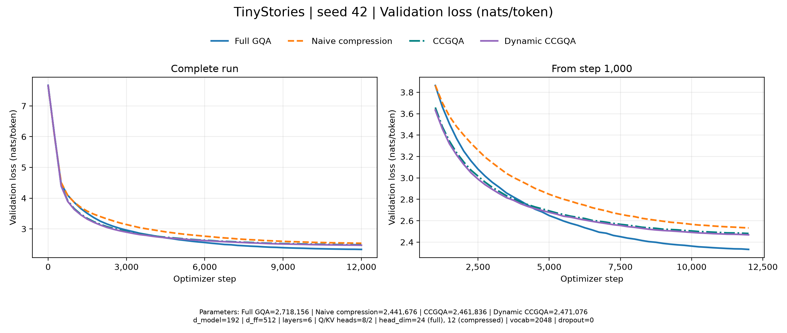
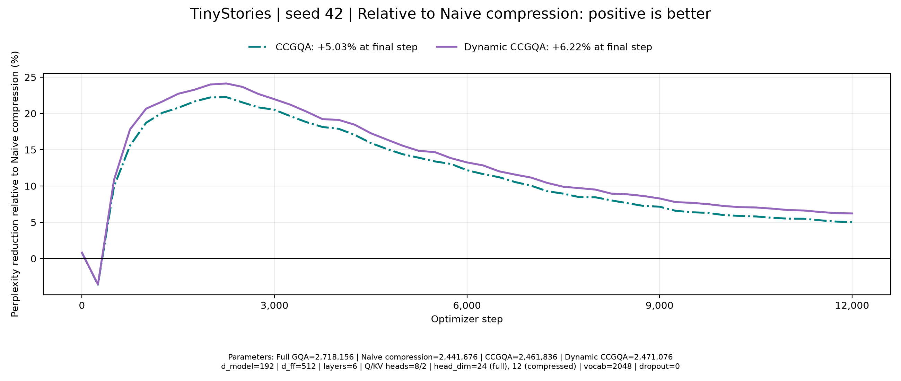
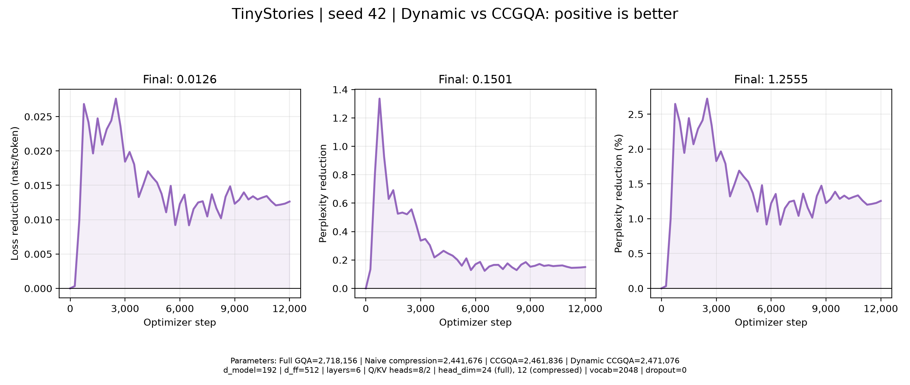

# mini-CCGQA: attention, compression, and small-model experiments

## 1. Motivation and scope

Attention can be made smaller by reducing the dimensions of its queries,
keys and values. The challenge is to preserve useful information in those
narrower representations.

This project studies compressed convolutional grouped-query attention
(CCGQA), the attention mechanism used in
[ZAYA1-8B](https://arxiv.org/pdf/2605.05365v1#page=3).
It compares full-width GQA, simple dimensional compression and CCGQA. I further propose an input-dependent extension, which I call Dynamic CCGQA, with the aim of improving how CCGQA uses local context within the compressed attention space. We train and evaluate all four models on [TinyStories](https://huggingface.co/datasets/roneneldan/TinyStories), using the same tokenizer, training budget and validation data for a controlled comparison.

The implementation focuses on the attention construction in the
[CCA paper, Section II-B](https://arxiv.org/pdf/2510.04476v2#page=4).
All models use a small dense decoder Transformer with SwiGLU feedforward
layers. We leave the integration of ZAYA's mixture-of-experts layers, MLP-based router and learned residual scaling for future work.

The architecture is implemented in [model.py](../src/mini_ccgqa/model.py).
The sections below explain its components, the experimental controls,
the results, and subsequent supervised fine-tuning.

## 2. From ordinary attention to compressed GQA

For a sequence of hidden states $X$, each attention head forms queries,
keys and values:

$$
Q=XW_Q,\qquad K=XW_K,\qquad V=XW_V.
$$

Causal attention computes

$$
A=\text{softmax}\left(\frac{QK^\top}{\sqrt d}+M\right),
\qquad O=AV,
$$

where $d$ is the head dimension and $M$ masks future positions.
Queries determine which keys are relevant; the resulting attention weights
combine the corresponding values. Head outputs are concatenated and
projected back to the residual width through $W_O$.

In multi-head attention, each query head has its own key and value head.
[Grouped-query attention, Section 2.2](https://arxiv.org/pdf/2305.13245v3#page=2)
shares each KV head across several query heads. Here, eight query heads
share two KV heads: queries 0–3 use KV head 0, and queries 4–7 use KV head 1.

### Model dimensions

All four models use residual width $D=192$, six layers, SwiGLU hidden
width 512, vocabulary size 2,048 and zero dropout. The attention head counts
are fixed at $H=8$ query heads and $K=2$ KV heads.

| Model | Head dimension $d$ | Q width $Hd$ | K/V width each $Kd$ | Parameters |
|---|---:|---:|---:|---:|
| Full GQA | 24 | 192 | 48 | 2,718,156 |
| Naive compressed GQA | 12 | 96 | 24 | 2,441,676 |
| CCGQA | 12 | 96 | 24 | 2,461,836 |
| Dynamic CCGQA | 12 | 96 | 24 | 2,471,076 |

**Naive compression** changes only the head dimension. In row-vector
notation, its query projection is $192\times96$, its key and value
projections are each $192\times24$, and its output projection is
$96\times192$. The residual stream and feedforward network retain their
original dimensions. All models are trained from scratch.

Halving the head dimension gives **2× compression of Q/K/V widths relative
to full GQA**. Relative to multi-head attention with total width 192,
the compressed query width is 2× smaller and each K/V width is 8× smaller.
These ratios match ZAYA's attention configuration, while the overall model
and training setup differ.
[ZAYA, Table I](https://arxiv.org/pdf/2605.05365v1#page=4)

### What compression saves

At fixed head counts and sequence length, halving $d$ halves the leading
arithmetic in $QK^\top$ and $AV$. It also halves the logical KV-cache
storage relative to full GQA, i.e. $\text{KV elements per layer}=2BTKd$ where $B$ is batch size and $T$ is the cached sequence length.

The attention matrix remains $T\times T$, so attention is still quadratic
in sequence length. Total parameter savings are smaller than 50% because
embeddings and feedforward layers are unchanged.

## 3. Shared Transformer components

### Residual blocks and SwiGLU

Each block applies RMSNorm before attention and before the feedforward layer:

$$
x'=x+\text{Attention}(\text{RMSNorm}(x)),
$$

$$
x''=x'+\text{FFN}(\text{RMSNorm}(x')).
$$

RMSNorm rescales each token vector using its root mean square, with
epsilon $10^{-5}$ and a learned scale per feature. The feedforward network is

$$
\text{FFN}(u)=
\left[\text{SiLU}(uW_{\rm gate})\odot(uW_{\rm up})\right]W_{\rm down}.
$$

A final RMSNorm precedes the vocabulary projection. Input embeddings and
output weights share one matrix $E$:

$$
x_t=E[\mathrm{token}_t],\qquad \mathrm{logits}_t=h_tE^\top.
$$

This tied matrix contains $2048\times192=393,216$ parameters, approximately
16% of each compressed model.

### Q/K normalization and learned scale

Input RMSNorm does not control the lengths of the projected Q/K vectors.
Because $q^\top k=\|q\|_2\|k\|_2\cos\phi$, attention scores can grow through
vector magnitude as well as alignment.

All four models normalize each Q/K head as

$$
\widehat q=\sqrt d\,\frac{q}{\max(\|q\|_2,\epsilon)},
\qquad
\widehat k=\sqrt d\,\frac{k}{\max(\|k\|_2,\epsilon)},
$$

where $\epsilon$ is the floating-point dtype's epsilon. This follows the
normalization described in
[CCA, Eq. (11)](https://arxiv.org/pdf/2510.04476v2#page=6).

A learned multiplier $\tau_j$ on key head $j$ then controls score scale:

$$
\ell_{t,s,h}
=\frac{\tau_{j(h)}}{\sqrt d}
(R_t\widehat q_{t,h})^\top(R_s\widehat k_{s,j(h)}).
$$

Here $j(h)$ identifies the KV head assigned to query head $h$, and $R_t$
is the positional rotation. 

Positive values of $\tau_j$ control attention sharpness; negative values reverse
score ordering. It is initialized to zero, so attention initially averages
uniformly over the allowed causal prefix. The multiplier can learn immediately,
while Q/K gradients through the score path are initially zero.

### Half-head RoPE

RoPE rotates coordinate pairs according to position:

$$
(a',b')=
(a\cos(t\omega)-b\sin(t\omega),\;
 a\sin(t\omega)+b\cos(t\omega)).
$$

Following [ZAYA's half-head RoPE](https://arxiv.org/pdf/2605.05365v1#page=6),
we rotate half the coordinates of each Q/K head. For $d=12$, the pairs
are $(0,3),(1,4),(2,5)$; coordinates 6–11 remain unchanged.

With rotating width $d_r=d/2$, the frequencies are

$$
\omega_i=10000^{-2i/d_r},\qquad i=0,\ldots,d_r/2-1.
$$

The dot product then combines a position-dependent term and an unrotated term:

$$
q_r^\top R_{s-t}k_r+q_u^\top k_u.
$$

The motivation for half-RoPE is to let attention combine positional relationships with content similarity. Rather than applying positional rotation to every feature, half-RoPE leaves some features available for direct comparison across positions. The model learns how to use both
contributions; they do not have fixed or exclusive roles.

The unrotated features are not necessarily free of positional information: earlier layers and causal convolutions may already have introduced it.

### Initialization

| Component | Initialization |
|---|---|
| Attention and SwiGLU linear weights | Normal with $\sigma=\sqrt{2/(d_{\rm in}+d_{\rm out})}$, truncated at $\pm3\sigma$ |
| Tied embedding/output weights | Normal with standard deviation 0.02 |
| RMSNorm scales | Ones |
| Learned key multipliers | Zeros |
| Convolution weights and biases | PyTorch `Conv1d` defaults |
| Dynamic gate weights and biases | Zeros |

These are the initialization settings of this implementation. The shared
normalization, positional encoding and initialization rules are retained
across the four attention variants.

## 4. Compressed convolutional GQA

`CCGQAttention` inherits the attention calculation from `GQAttention`
and changes the construction of Q/K/V through `project()`. Three operations
are added before Q/K normalization and RoPE.

### Causal Q/K convolutions

Raw query and key projections are concatenated into a tensor with
$(H+K)d=120$ channels: eight query heads and two key heads, each containing
twelve channels. Two causal convolutions process these features before
attention.
[CCA, Eq. (8)](https://arxiv.org/pdf/2510.04476v2#page=5)

We use the following indices:

- $t$: token position.
- $h$: a particular query or key head.
- $c$: output channel within that head.
- $j$: input channel within that head.

Each Transformer layer has its own convolution parameters; the layer
index is omitted below. Within a layer, parameters are shared across
token positions and batch examples, but not across different heads.

**First convolution: filter each channel across time.**

The depthwise convolution computes

$$u_{t,h,c}=a^{(h)}_{c,-1}z_{t-1,h,c}+a^{(h)}_{c,0}z_{t,h,c}+b^{\mathrm{depth}}_{h,c}.$$

For every channel $c$ of every head $h$, it learns two weights and one bias:

$$a^{(h)}_{c,-1},\qquad a^{(h)}_{c,0},\qquad b^{\mathrm{depth}}_{h,c}.$$

The subscripts $-1$ and $0$ identify the previous-position and
current-position coefficients. These parameters do not depend on $t$:
the same filter slides across the sequence, combining a different pair
of input positions each time.

There is no sum over channels. Output channel $c$ depends only on the
same input channel, and every channel has its own filter and bias.
The implementation therefore uses 120 convolution groups, one per channel.

**Second convolution: combine channels and time within each head.**

The headwise convolution computes

$$s_{t,h,c}=\sum_{j=1}^{d}\left[B^{(h)}_{-1,cj}u_{t-1,h,j}+B^{(h)}_{0,cj}u_{t,h,j}\right]+b^{\mathrm{head}}_{h,c}.$$

Each head has two learned mixing matrices and a bias vector:

$$B^{(h)}_{-1},B^{(h)}_0\in\mathbb{R}^{d\times d},\qquad b^{\mathrm{head}}_h\in\mathbb{R}^{d}.$$

For output channel $c$, row $c$ of each matrix specifies how to combine
the input channels $j$. Thus, the second convolution mixes both temporal
positions and feature channels.

These matrices and biases are also shared across token positions.
Different heads have separate parameter sets. The implementation uses
ten groups, one per query or key head, so channels from different heads
never mix inside these convolutions.

Capital $B$ denotes mixing weights. Lowercase $b$ denotes an additive
bias; the labels “depth” and “head” distinguish the two convolutions'
separate bias parameters.

**Why use both convolutions?**

The second convolution operates on features that have already been
filtered across time:

$$
u_{t,h}\leftarrow(z_{t,h},z_{t-1,h}),
\qquad
u_{t-1,h}\leftarrow(z_{t-1,h},z_{t-2,h}).
$$

Consequently, the complete stack covers three original positions:
$t,t-1,t-2$. A width-two headwise convolution alone would cover only
two positions.

There is no activation between the convolutions. The static stack is
therefore an affine transformation that can be represented as a single
width-three headwise convolution. Its effective coefficients are
constrained by the two-layer factorization, rather than being
independently learned matrices for all three positions.

This factorization uses fewer weights than an unrestricted width-three
headwise convolution.

| Construction | Weights per head, excluding biases | At $d=12$ |
|---|---:|---:|
| Depthwise width 2 + headwise width 2 | $2d+2d^2$ | 312 |
| Unrestricted headwise width 3 | $3d^2$ | 432 |

The interpretation is to first learn a temporal filter for each feature,
then combine the filtered features within its head. This provides a
structured way to build locally informed Q/K representations before
attention compares positions across the full causal prefix.

**Padding and causality.**

Both kernels have width two. We apply two positions of zero-padding on
the left before the convolution stack. Each convolution then reduces the
sequence length by one:

$$
T\rightarrow T+2\rightarrow T+1\rightarrow T.
$$

The final output retains the original sequence length and depends only
on the current and previous tokens, preserving causality.

Padding once allows the first convolution to process an initial all-zero window and produce an extra intermediate output equal to its learned bias. The second convolution combines this boundary output with the representation of the first real token, so the first token’s output is not forced to zero. Padding each layer separately instead inserts a zero at the intermediate boundary, removing that additional bias contribution. Both approaches preserve causality; we use padding once to match the reference implementation [CCA (Appendix A.1, Listing 1, p. 12)](https://arxiv.org/pdf/2510.04476v2#page=12).

### Shared Q/K means

For query head $h$, let $j(h)$ denote its KV group. Shared features are
computed from the raw projections, before convolution:

$$
m^Q_{t,h}=\frac{q^0_{t,h}+k^0_{t,j(h)}}{2},
\qquad
m^K_{t,j}=\frac{1}{G}\sum_{h:j(h)=j}m^Q_{t,h},
$$

where $G=H/K=4$. They are added to the convolution outputs:

$$
q_{t,h}=s^Q_{t,h}+m^Q_{t,h},
\qquad
k_{t,j}=s^K_{t,j}+m^K_{t,j}.
$$

These additions share information between queries and keys and preserve
a direct path from the current token. They introduce no learned parameters
and average across heads, not across sequence positions.
[CCA, Eq. (9)](https://arxiv.org/pdf/2510.04476v2#page=5)

### Value delay

The flattened value projection is split into two halves:

$$
v'_t=[v_t^{\rm first},v_{t-1}^{\rm second}].
$$

At the first position, the delayed half is zero. With two KV heads,
this delays the entire second value head. The first head carries current
features and the second carries previous-position features.
[CCA, Eq. (10)](https://arxiv.org/pdf/2510.04476v2#page=6)

The resulting Q/K/V enter the shared normalized attention calculation.
The intended benefit is richer local information within the compressed
representation.

## 5. Dynamic CCGQA

The useful balance between current and neighboring features may vary
with context. Static CCGQA uses the same temporal filters at every
position, limiting its ability to adapt this local mixing to the input.

To make local Q/K feature construction more flexible, we introduce
**Dynamic CCGQA**. It modifies only the first, depthwise Q/K convolution,
using input-dependent gates to adjust the contributions from the previous
and current positions. The attention widths remain unchanged.

### Predicting the gates

Let $x_{t,i}$ denote feature $i$ of the normalized hidden state entering
attention at position $t$, where $i=1,\ldots,D$. For each KV group $j$,
the model predicts two scalar gates:

$$g^{r}_{t,j}=2\sigma\left(\sum_{i=1}^{D}\left[\alpha^{r}_{j,i}x_{t,i}+\beta^{r}_{j,i}x_{t-1,i}\right]+b^{r}_j\right),\qquad r\in\{\mathrm{past},\mathrm{current}\}.$$

The learned weights $\alpha$ and $\beta$ read the current and previous
hidden states, respectively. The sum runs over hidden features, not
sequence positions. At the first position, the previous hidden state
is zero.

The label $r$ identifies which convolution contribution the gate
controls. Both gates inspect both hidden states. Each group and layer
has its own gate-generator parameters, shared across positions; the
resulting gate values depend on the input.

In the code, this calculation uses concatenation followed by an affine
projection. Joining two vectors with $D$ features gives $2D$ input
features, allowing separate weights for the current and previous states.

With two KV groups, the generator produces four gates per position.
Each pair is shared across all channels of the four query heads and
the key head belonging to its group. The gates do not act on V.

### Applying the gates

Using the notation of Section 4, the first convolution becomes

$$u_{t,h,c}=a^{(h)}_{c,-1}g^{\mathrm{past}}_{t,j(h)}z_{t-1,h,c}+a^{(h)}_{c,0}g^{\mathrm{current}}_{t,j(h)}z_{t,h,c}+b^{\mathrm{depth}}_{h,c}.$$

Here $h$ identifies a query or key head, $c$ a channel within it, and
$j(h)$ its KV group. Each channel retains its own learned convolution
coefficients. The gates modulate their contributions, while the
additive bias remains unchanged.

The second, headwise convolution and the shared Q/K means retain their
original definitions. V receives the same value delay as in static
CCGQA. The resulting Q/K/V enter the unchanged normalization, learned
key scaling, HalfRoPE and causal attention calculation.

The gates therefore influence which values attention combines by
changing Q/K features and their attention scores. They do not directly
transform the values.

### Gate function and initialization

The sigmoid $\sigma(u)=1/(1+e^{-u})$, multiplied by two, keeps the gated value in the range $(0,2)$. A gate below one suppresses its contribution, a gate of one
leaves it unchanged, and a gate above one amplifies it.

The two gates are independent and need not sum to one. Both contributions
can increase or decrease together, and their relative balance can change.
Because the gates are positive, they preserve the signs of the underlying
convolution coefficients.

Gate weights and biases start at zero, giving $2\sigma(0)=1$.
Dynamic CCGQA therefore initially reproduces static CCGQA when their
shared parameters match. The implementation computes
`delta = 2 * sigmoid(logits) - 1` and adds corrections to the original
depthwise convolution, preserving its biases and padding behavior.

Sigmoid provides smooth, bounded modulation, but it can saturate:
large positive or negative inputs produce small gate derivatives.
Zero initialization places it in its most responsive region, where
the derivative of $2\sigma(u)$ is $1/2$. This avoids initial sigmoid
saturation, although it does not guarantee strong gradients throughout
training. The gate function is a design choice, not a claimed optimum.

### Parameter cost and intended benefit

Each gate has $D$ weights for the current hidden state, $D$ for the
previous state, and one bias. With two gates per KV group, six layers,
$K=2$ and $D=192$, the additional parameter count is

$$6(2K)(2D+1)=6\cdot 4\cdot 385 = 9,240,$$

approximately 0.375% of static CCGQA.

Changing the previous/current mixture can change Q/K directions, so
its effect is not generally removed by length normalization. It also
cannot generally be absorbed into a fixed output projection $W_O$,
because the mixture varies with the input and changes attention scores
before that projection.

The intended benefit is more selective use of local context within
the compressed representation. Section 7 evaluates whether this
modification improves language modeling.

## 6. Data and training protocol
We use [TinyStories](https://huggingface.co/datasets/roneneldan/TinyStories)
with a byte-level BPE tokenizer trained on the first 50,000 nonempty
training stories. The vocabulary contains 2,048 tokens, including
`<|endoftext|>` (EOS). The tokenizer is then frozen and shared across
all four models.

[data.py](../src/mini_ccgqa/data.py) removes duplicate validation
stories and validation stories that exactly match a training story.
Stories are tokenized and joined with EOS markers.

During [train.py](../src/mini_ccgqa/train.py), we sample random 256-token
windows with replacement and predict the next token at each position.
Windows may cross story boundaries; EOS marks those boundaries but
does not reset the causal attention mask.

The objective is mean next-token cross-entropy:

$$
L=-\frac{1}{N}\sum_{t=1}^{N}\log p_\theta(y_t\mid x_{\leq t}),
\qquad \mathrm{PPL}=e^L.
$$

| Setting | All four base models |
|---|---|
| Optimizer updates | 12,000 |
| Batch size / sequence length / accumulation | 16 / 256 / 1 |
| Training token exposures | 49,152,000 per model |
| Optimizer | AdamW; betas (0.9, 0.999), epsilon $10^{-8}$ |
| Learning-rate schedule | 240-step warm-up to $3\times10^{-4}$, then cosine decay to $3\times10^{-5}$ |
| Weight decay | 0.05 for parameters with at least two dimensions; zero otherwise |
| Gradient clipping | Global norm 1.0 |
| Seed | 42 |
| Evaluation and checkpoint interval | 250 updates |
| Evaluation subsets | Fixed 65,536 training tokens and 65,536 validation tokens |

All models use the same tokenizer, training-window stream and evaluation
windows. A separate random generator keeps batch selection independent of
model initialization. 

## 7. Results and interpretation

We compare all four models after 12,000 optimizer updates, using the same
training token budget and fixed validation set. Full GQA achieves the
lowest final loss. Among the compressed models, CCGQA improves on simple
dimensional compression, and Dynamic CCGQA provides a further small gain.

| Model | Parameters | Validation loss (nats/token) | Perplexity |
|---|---:|---:|---:|
| Full GQA | 2,718,156 | 2.3322 | 10.300 |
| Naive compressed GQA | 2,441,676 | 2.5326 | 12.586 |
| CCGQA | 2,461,836 | 2.4810 | 11.954 |
| Dynamic CCGQA | 2,471,076 | 2.4684 | 11.804 |

### Quality under compression

*Figure 1. Validation loss over the complete run and a closer view of
later training. The corresponding
[perplexity curves](../assets/comparison/02_validation_perplexity.png)
show similar trends.*

The CCGQA variants achieve lower validation loss than full GQA during
much of early training, despite having fewer parameters. Their local
feature construction may help them learn useful representations within
the narrower attention space. With continued training, full GQA overtakes
both variants and remains ahead from step 4,500 onward, suggesting that
its wider attention eventually benefits more from the additional training tokens.

Compression leaves the residual stream and feedforward network unchanged,
so the parameter savings come from smaller attention projections. The [comparison against full GQA](../assets/comparison/04_relative_to_full_gqa.png)
shows how this quality–size tradeoff develops during training.

Within the compressed models, CCGQA outperforms naive dimensional
reduction, and Dynamic CCGQA improves further. Since these models use
the same attention widths, the results support the value of constructing
richer local features before attention. These additions recover part
of the quality lost through compression, while a gap to full GQA remains.

### Improvement over naive compression

For a candidate model $A$ and reference model $B$, we report relative
perplexity reduction as

$$100\left(1-\frac{\mathrm{PPL}_A}{\mathrm{PPL}_B}\right)=100\left(1-e^{L_A-L_B}\right).$$

Positive values indicate improvement over the reference.

*Figure 2. Relative perplexity reduction against naive compressed GQA.*

At the final checkpoint, CCGQA reduces validation perplexity by **5.03%**
relative to naive compressed GQA, while Dynamic CCGQA achieves a
**6.22%** reduction. Compared with the same naive compressed model, CCGQA adds
20,160 parameters and Dynamic CCGQA adds 29,400 parameter increases
of approximately **0.83%** and **1.20%**, respectively.

The results support improving how the compressed features are constructed.
They also show that these additions recover only part of the performance
gap to full-width attention under the present training budget.

### What the dynamic gates add

*Figure 3. Loss reduction, absolute perplexity reduction and relative
perplexity reduction from adding the dynamic gates.*

Dynamic CCGQA finishes with **1.26% lower perplexity than CCGQA**, adding
9,240 parameters, or approximately 0.375%. The absolute improvement is
0.01263 nats/token in loss and 0.1501 in perplexity.

Although modest, the advantage appears at every recorded evaluation after
initialization, from step 250 through step 12,000. During the second half
of training, its relative perplexity reduction remains approximately
0.9–1.5%. The gain is therefore sustained across the observed training
trajectory, rather than appearing only at the final checkpoint.

The [training–validation gap](../assets/comparison/05_validation_gap.png)
provides additional context. Validation loss continues to decrease for
all four models throughout the run, with no observed reversal.

### Further evaluation

The sustained dynamic advantage motivates longer training and experiments
at larger model scales. These would test whether the improvement persists
and whether the compressed models move closer to full GQA. 

This comparison uses one seed, one model scale and one training schedule.
Repeating all four variants across seeds and scales would strengthen the
evidence. 

## 8. Supervised fine-tuning and generation

We further train the Dynamic CCGQA base model for summary-to-story
generation. The goal is to adapt its pretrained language representations
to a specific task: generating a story conditioned on a short summary.

### Data and training

We use summary–story pairs from
[aditya-6122/tiny-stories-instruct](https://huggingface.co/datasets/aditya-6122/tiny-stories-instruct).
[sft_data.py](../src/mini_ccgqa/sft_data.py) selects 10,000 training
examples and 500 validation examples, removing exact duplicate stories
within and across these selected sets. Each complete prompt, story and
EOS must fit within the 256-token context.

Each summary is formatted as
`Summary: ...\nStory:\n`, followed by its target story and EOS.
The model reads the prompt as context, but the loss is computed only
over story tokens and EOS. Prompt and padding positions are excluded:

$$L_{\mathrm{SFT}}=-\frac{1}{N_{\mathrm{response}}}\sum_{\text{response positions }t}\log p_\theta(y_t \mid \text{prompt}, y_{<t}).$$

[sft.py](../src/mini_ccgqa/sft.py) updates all model weights,
without LoRA or other adapters. Training examples are shuffled each
epoch and processed in batches of 16. Four epochs give 2,500 optimizer
updates. AdamW uses 100 warm-up updates to a peak learning rate of
$3\times10^{-4}$, followed by cosine decay to $3\times10^{-5}$.
Weight decay is 0.01 on matrix parameters, with gradient clipping
at norm 1.0.

Training and validation loss are monitored every 125 updates, and the
checkpoint with the lowest validation loss is saved. Base checkpoints
remain unchanged under `runs/base`; SFT checkpoints are stored separately
under `runs/sft`.

### Evaluation and results

[compare_sft.py](../src/mini_ccgqa/compare_sft.py) compares both
models on the same 500 validation examples, containing 86,534 story
and EOS targets. These examples are excluded from SFT weight updates.

We report response cross-entropy, perplexity and **next-token accuracy**.
Accuracy measures how often the model's highest-probability token matches
the reference next token:

$$\mathrm{Accuracy}=100\times\frac{\text{correct top-1 response-token predictions}}{\text{total response-token targets}}.$$

The count includes story tokens and EOS, excludes prompt and padding
positions, and is accumulated across all validation examples. It measures
exact BPE-token matches, rather than complete-word or complete-story
correctness.

| Model | Response loss (nats/token) | Perplexity | Next-token accuracy |
|---|---:|---:|---:|
| Dynamic CCGQA base | 2.4653 | 11.767 | 46.49% |
| Dynamic CCGQA after SFT | 2.1525 | 8.606 | 51.03% |

SFT reduces response perplexity by **26.86%** and increases next-token
accuracy by **4.54 percentage points**. These results show improved
prediction of reference stories under the summary-to-story format.

Evaluation uses **teacher forcing**: each prediction receives the prompt
and the true preceding story tokens. Incorrect predictions are not fed
back into subsequent positions. Consequently, these metrics measure
conditional token prediction, not the quality of freely generated stories.

This validation set differs from the pretraining evaluation set, so its
loss and perplexity should not be compared directly with Section 7.
Although held out from SFT updates, overlap with the original pretraining
corpus has not been ruled out.

### Autoregressive generation

The [generate.py](../src/mini_ccgqa/generate.py) supports greedy,
top-k and top-p decoding. We also compare the base and SFT models on
20 shared summary prompts using matching decoding settings.

During generation, each predicted token becomes part of the context for
the next prediction, allowing errors to accumulate. The generated samples
still contain repetition, inconsistent characters and topic drift.
The numerical gains therefore demonstrate improved token prediction,
while stronger claims about story coherence or adherence to the summary
require a separate assessment of generated outputs.